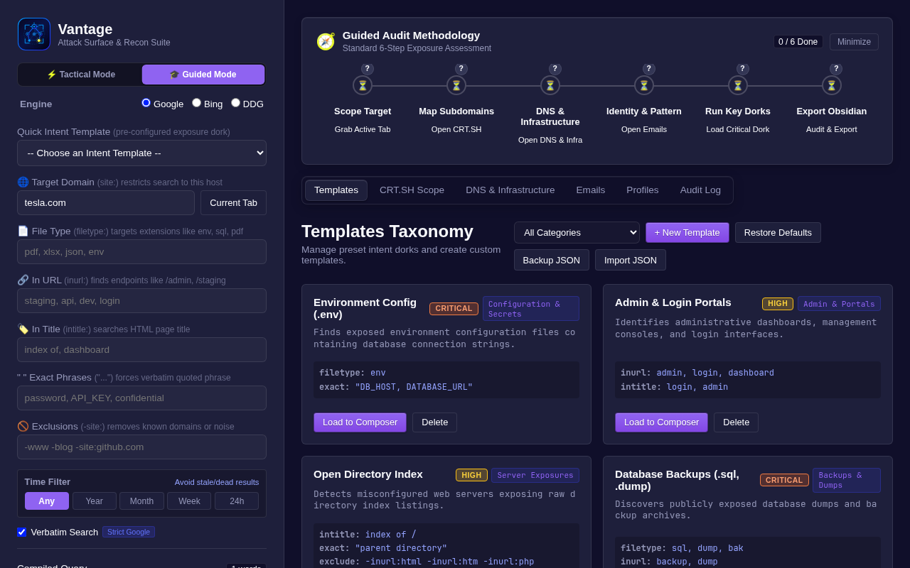
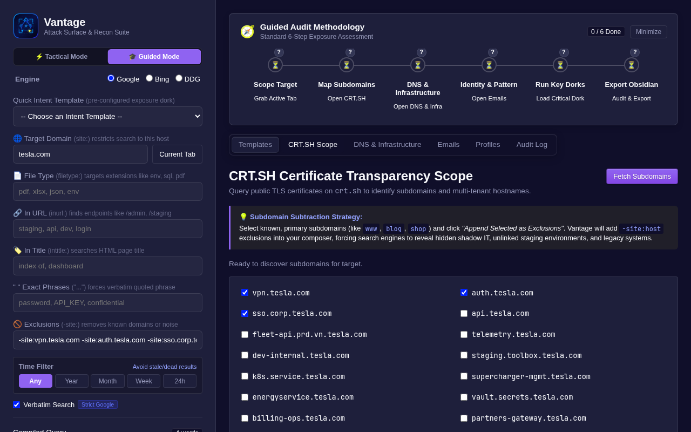
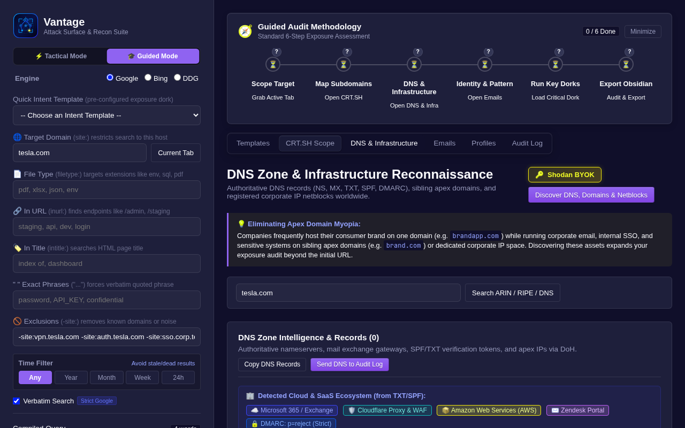

# 🔭 Vantage

> **Passive Attack Surface Reconnaissance, Corporate Infrastructure Mapping & Exposure Audit Suite**  
> *A zero-touch, browser-native intelligence and exposure assessment tool for security analysts, penetration testers, and bug bounty researchers.*

---

## 🌟 Overview

**Vantage** (formerly QueryScope) transforms your browser into a high-ground attack surface reconnaissance workstation. Instead of opening 10 browser tabs and running CLI scripts across multiple tools during initial target scoping, Vantage unifies passive certificate discovery, global RIR registration, reverse DNS probing, Shodan host telemetry, identity intelligence, and precision Google dorking into a single, cohesive dashboard.

All discovery is **100% passive and zero-touch**—Vantage queries public third-party telemetry (ARIN, RIPE, crt.sh, Google DoH, Ubuntu OpenPGP, Shodan InternetDB) without ever sending a direct network packet to the target company's servers.

---

## 📸 Workstation Screenshots

### 1. Attack Surface Reconnaissance & Dork Composer


### 2. CRT.SH Certificate Scope & Subdomain Subtraction


### 3. DNS Zone Intelligence & Cloud/SaaS Infrastructure


---

## ✨ Key Features

### 🧭 1. Guided 6-Step Audit Methodology
A built-in tactical roadmap taking analysts step-by-step through a standard reconnaissance lifecycle:
1. **Scope Target**: Extract root apex domain and baseline boundaries from the active tab.
2. **Map Subdomains**: Query public Certificate Transparency (CT) logs via `crt.sh`.
3. **Infrastructure & Nets**: Uncover sibling corporate apexes, query ARIN/RIPE netblocks, probe reverse DNS PTR records, and inspect open ports via Shodan InternetDB.
4. **Identity & Pattern**: Harvest technical contacts from OpenPGP keyservers and deduce the corporate email convention (`first.last@`, `flast@`, etc.).
5. **Run Key Dorks**: Apply precision Google search operators targeting secrets, `.env` files, backups, and exposed administrative consoles.
6. **Audit & Export**: Categorize findings and export a structured Markdown report formatted for Obsidian or Joplin vaults.

*Includes interactive "What & Why" educational modals on every step for analysts building tradecraft.*

### 🏢 2. Multi-Domain SAN Sibling Discovery
Cross-correlates multi-domain SSL/TLS certificates to automatically surface corporate sibling apexes, sister subsidiaries, and acquired brands (e.g. discovering subsidiary apexes and out-of-band SaaS domains from primary certificates).

### 🌐 3. Regional Internet Registry (RIR) Netblocks
Directly queries ARIN and RIPE RDAP registries to discover corporate IP blocks registered directly to the target organization, complete with PTR reverse DNS probing and SOA zone master identification.

### ⚡ 4. Shodan InternetDB & BYOK Integration
- **InternetDB (Free & Built-in)**: Instant host intelligence with zero API key required—surfaces open ports, service tags, and known vulnerabilities (CVEs).
- **Personal Shodan BYOK**: Seamless drawer allowing analysts to connect their personal Shodan API key for deep banner inspection, OS fingerprinting, and full host history.

### 🛡️ 5. Precision Search Syntax Builder & Linter
- Real-time compiler for Google, Bing, and DuckDuckGo search syntax.
- Built-in linter catching common operator syntax traps, whitespace bugs, and quote errors.
- Temporal filtering (`24h`, `week`, `month`, `year`) and Google Verbatim mode (`&tbs=li:1`) toggles.
- Pre-configured template library categorized by risk (Critical, High, Medium, Low).

### 📝 6. Obsidian Vault Triage & Export
One-click export of discovered findings, analyst notes, and remediation status into clean, pre-tagged Markdown notes ready to drop straight into your vulnerability management or triage vault.

---

## 🚀 Quick Start & Installation

### Option 1: Load in Firefox
1. Clone or download this repository.
2. Open Firefox and navigate to `about:debugging#/runtime/this-firefox`.
3. Click **"Load Temporary Add-on..."**.
4. Select `manifest.json` from the repository root (or `dist/firefox/manifest.json`).

### Option 2: Load in Chrome / Brave / Edge
1. Clone or download this repository.
2. Build the distribution: `npm run build` (or `node build.js`).
3. Open your browser and navigate to `chrome://extensions`.
4. Enable **"Developer mode"** in the top-right corner.
5. Click **"Load unpacked"** in the top-left corner and select the `dist/chrome/` folder.

---

## 🛠️ Build & Packaging Pipeline

Vantage includes an automated cross-browser build script that generates store-ready archives for both Mozilla AMO and Chrome Web Store:

```bash
# Validate JavaScript syntax and package distributions
npm run build
```

This creates:
- `dist/vantage-firefox-v1.1.4.zip` — Ready for upload to the [Firefox Add-on Developer Hub](https://addons.mozilla.org/developers/).
- `dist/vantage-chrome-v1.1.4.zip` — Ready for upload to the [Chrome Web Store Developer Dashboard](https://chrome.google.com/webstore/devconsole).
- `dist/firefox/` & `dist/chrome/` — Unpacked development trees.

See [DISTRIBUTION.md](DISTRIBUTION.md) for full store submission guidance and permission justifications.

---

## 🔒 Privacy & Architecture

- **100% Client-Side**: Vantage runs entirely inside your browser. No telemetry, user data, queries, or API keys are ever transmitted to private backends or third parties.
- **Zero-Packet Passive Scoping**: Vantage queries public OSINT endpoints (crt.sh, Cloudflare/Google DoH, ARIN/RIPE RDAP, OpenPGP keyservers, Shodan). It never sends malicious payloads or direct scans to target web servers.
- **Local Storage**: All templates, custom profiles, and audit records are saved strictly in your local browser storage (`browser.storage.local`).

See our full [Privacy Policy](PRIVACY.md) for complete details.

---

## 🗺️ Product Roadmap

Looking to see what's planned next? Check out our [Feature & Engineering Roadmap](ROADMAP.md) covering upcoming milestones for virtualization, Burp/Caido export integration, and interactive attack surface visualization.

---

## 📄 License

This project is licensed under the [MIT License](LICENSE).
