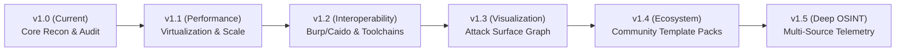

# 🔭 Vantage Feature & Engineering Roadmap

This document outlines the strategic product roadmap and engineering milestones for **Vantage** as it evolves from a high-performance reconnaissance browser extension into an industry-standard passive attack surface assessment suite.

---

## 🗺️ Milestone Overview



---

## 📌 Phase 1: High-Performance & Massive Scale (v1.1.0)
*Focus: Ensuring Vantage runs at 60fps on massive enterprise targets (5,000–50,000+ certificates) without browser DOM thrashing.*

### 🚀 Key Deliverables
- [ ] **Virtualized List Rendering (DOM Windowing)**
  - Replace raw DOM injection in CRT.SH (`#crt-results`) with a lightweight virtualized scroll container.
  - Render only the 30–50 rows visible in the active viewport, recalculating on scroll.
  - Eliminates UI freeze when analyzing massive targets like `google.com`, `uber.com`, or `microsoft.com`.
- [ ] **Configurable Pagination Controls**
  - Add page navigation (`50`, `100`, `250`, `All`) with page jump and item count badges.
- [ ] **Advanced Filtering & Inversion**
  - Add regex search support in the subdomain and email filters.
  - Add quick toggles: `Hide Wildcards (*.)`, `Apex Only`, `Live Only`.
  - Add an **"Invert Selection"** action for rapid triage of non-standard hosts.
- [ ] **Background Memory Optimization**
  - Stream large JSON array parsing in chunks to prevent blocking the main browser thread.

---

## 📌 Phase 2: Security Toolchain Interoperability (v1.2.0)
*Focus: Seamlessly passing Vantage discoveries into professional offensive and defensive security workflows.*

### 🚀 Key Deliverables
- [ ] **Burp Suite Project Scope Exporter**
  - Generate copyable JSON in native Burp Suite Target Scope format:
    ```json
    {
      "target": {
        "scope": {
          "advanced_mode": true,
          "include": [{"enabled": true, "host": "^.*\\.target\\.com$", "protocol": "any"}]
        }
      }
    }
    ```
- [ ] **Caido Scope Integration**
  - One-click format generation compatible with Caido rule sets and scope definitions.
- [ ] **CLI Tool Piping & Formats**
  - **Nuclei / HTTPX Target List**: Export newline-delimited host lists (`hosts.txt`) for immediate CLI feeding.
  - **CSV / TSV Export**: Export table structures for spreadsheet analysis, Jira ticket attachments, and executive deliverables.
  - **NDJSON (JSON Lines)**: Standardized event format for ingestion into Elasticsearch, Splunk, or SIEM pipelines.
- [ ] **Multi-Dialect Markdown & Clipboard Exporter**
  - Flexible editor flavor selector before exporting or copying findings:
    - **Obsidian Vault (Default)**: YAML frontmatter, native callouts (`> [!WARNING]`), and tag pills.
    - **Standard Raw GFM**: GitHub, GitLab, Jira, VS Code, and Typora compatible with standard bold/code formatting.
    - **Notion & Confluence**: Clean document layout, blockquotes, and collapsible `<details><summary>` toggle lists.
    - **Outliner Format**: Logseq and Roam Research indented bullet hierarchy.
  - **"Copy Markdown to Clipboard"** one-click action to eliminate `~/Downloads` file clutter.
  - Persistent editor preference stored in `browser.storage.local`.

---

## 📌 Phase 3: Attack Surface Visualization Graph (v1.3.0)
*Focus: Providing intuitive, interactive visual node graphs of corporate relationships, cloud footprints, and infrastructure.*

### 🚀 Key Deliverables
- [ ] **Interactive Attack Surface Node Graph**
  - Render an interactive Canvas/SVG topology tree in the **DNS & Infrastructure** tab:
    - **Root Apex Domain** ➔ **Authoritative NS** ➔ **Mail Gateways (MX)**
    - **Corporate Netblocks (CIDRs)** ➔ **Reverse PTR Hosts**
    - **Detected Cloud & SaaS Ecosystem** (Google Workspace, M365, AWS, Cloudflare, Salesforce)
- [ ] **Visual Node Interactions**
  - Clicking any node provides contextual actions: `+ Set as Target`, `+ Generate Dork`, `🔍 urlscan Lookup`, `Copy Value`.
  - Color-coded cluster badges indicating risk (e.g. self-hosted mail gateways vs. managed cloud).
- [ ] **Lightweight Implementation**
  - Zero heavy external dependencies; built using lightweight native SVG force-directed physics or canvas rendering.

---

## 📌 Phase 4: Community Dork Packs & Multi-Domain Workspaces (v1.4.0)
*Focus: Team collaboration, specialized dork profiles, and client project management.*

### 🚀 Key Deliverables
- [ ] **Portable Dork Template Packs (Import / Export)**
  - Allow security teams to export and share custom dork categories as `.json` packs.
  - **Curated Starter Packs**:
    - 🎯 *Bug Bounty & Web Application Pentesting Pack*
    - ☁️ *Cloud Storage & Public Bucket Leak Pack* (AWS S3, Azure Blob, GCP Storage)
    - 🔑 *CI/CD, DevOps & Secret Leak Pack* (.git, .env, Jenkins, ArgoCD, Jira)
    - 🎓 *Higher Education & Government Exposure Pack*
- [ ] **Multi-Domain Engagement Workspaces**
  - Group multiple related domains (parent corporations, acquired subsidiaries, regional TLDs) under a single named assessment project (e.g. `"Acme Corp Annual Audit"`).
  - Aggregated audit findings view across all associated project targets.

---

## 📌 Phase 5: Deep Passive OSINT & Posture Scoring (v1.5.0)
*Focus: Broadening passive intelligence feeds while maintaining strict zero-touch OPSEC.*

### 🚀 Key Deliverables
- [ ] **Redundant Passive Certificate Feeds**
  - Integrate free secondary CT caches (CertSpotter, AlienVault OTX, HackerTarget) with automatic failover if `crt.sh` is unavailable.
- [ ] **Automated Email Security Posture Score**
  - Grade target SPF/DMARC posture (`A+` to `F`) based on spoofability:
    - Checks for `p=reject` vs `p=none` or missing DMARC.
    - Flags dangerous SPF mechanisms (`+all`, missing include records).
- [ ] **Wayback Machine CDX API Deep Search**
  - Expand the current Wayback button into a passive historical path scraper:
    - Query `web.archive.org/cdx/search/cdx?url=*.target.com/*&output=json&fl=original&collapse=urlkey`
    - Filter for archived files (`.pdf`, `.xls`, `.config`, `.bak`, `.sql`).

---

## 📊 Prioritization Matrix

| Feature | Impact | Effort | Target Milestone |
| :--- | :---: | :---: | :---: |
| **Virtualized DOM for CRT.SH** | 🔴 High | 🟡 Medium | v1.1.0 |
| **Multi-Dialect Markdown & Clipboard Copy** | 🔴 High | 🟢 Low | v1.2.0 |
| **Burp / Nuclei Scope Exporters** | 🔴 High | 🟢 Low | v1.2.0 |
| **Custom Dork Pack Import/Export** | 🟡 Medium | 🟢 Low | v1.2.0 |
| **Interactive Infrastructure Graph** | 🔴 High | 🔴 High | v1.3.0 |
| **Multi-Domain Workspaces** | 🟡 Medium | 🟡 Medium | v1.4.0 |
| **Passive DNS Fallback Feeds** | 🟡 Medium | 🟡 Medium | v1.5.0 |
| **Wayback CDX Path Miner** | 🔴 High | 🟡 Medium | v1.5.0 |
